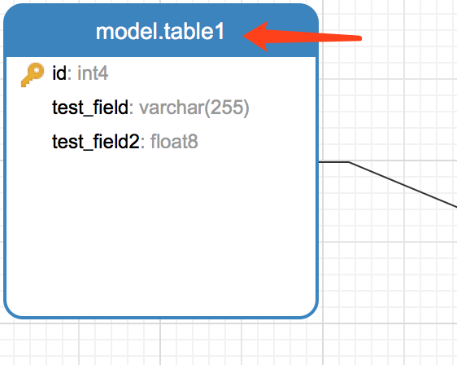
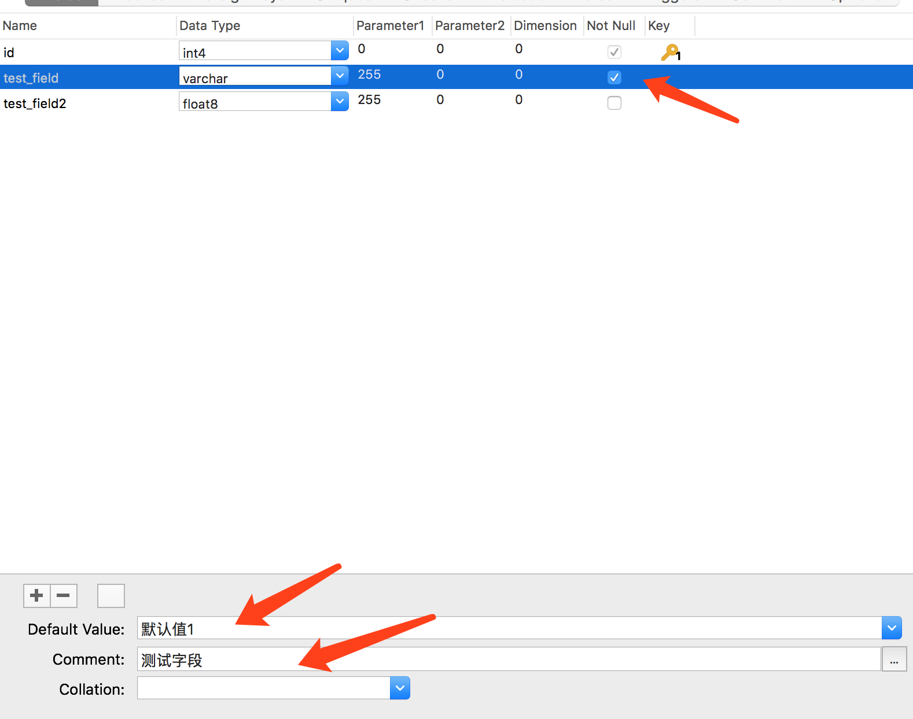
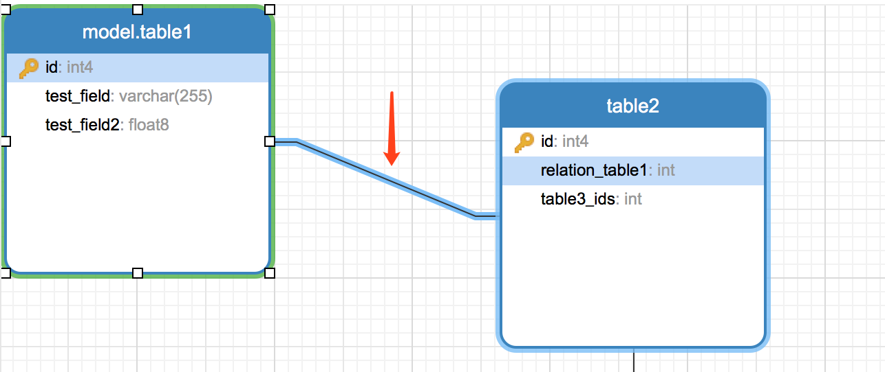
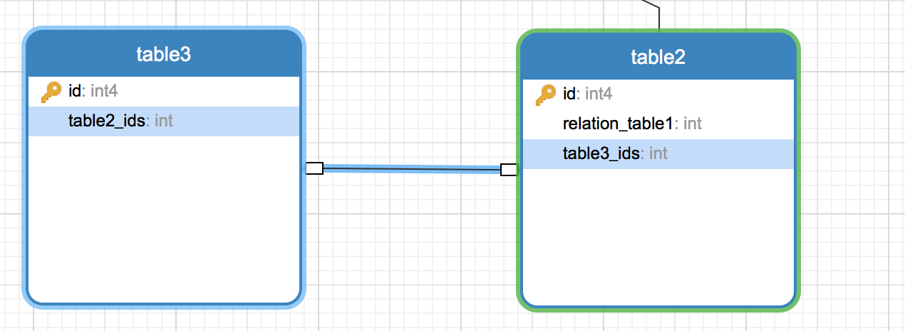
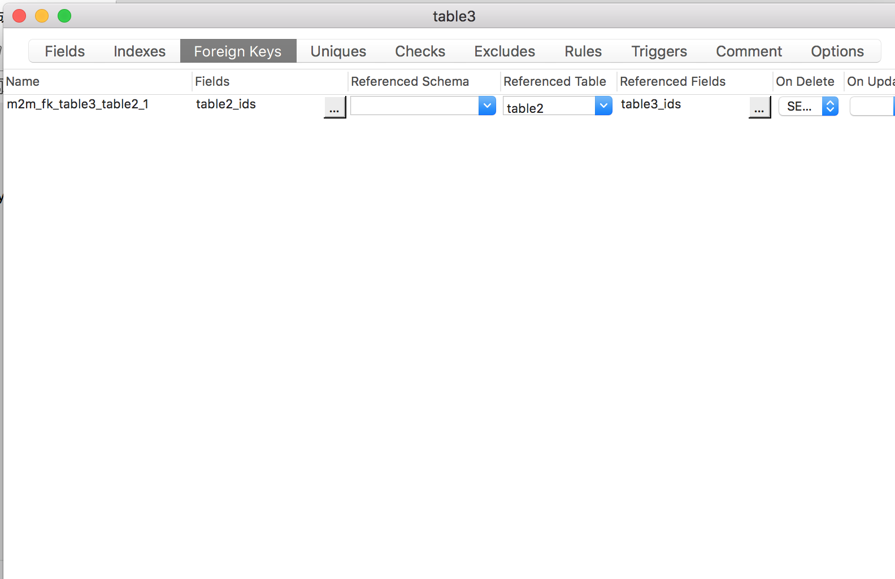

# [Odoo](https://github.com/odoo/odoo "Odoo's github")模块代码生成器
该项目能根据sql文件的内容生成odoo模块的model和view基本代码

## 依赖项
> python版本: 3.5+   
> pip模块: sqlparse 0.2.4

## sql文件生成工具
> 推荐**Navicat for PostgreSQL** 12.1

## 说明
1. 该项目支持解析出Odoo内的Char、Text、Int、Float、Bool、Date、DateTime、Binary、Many2one、One2many、Many2many字段
    对应sql中的数据类型为：
    ```python
    ['varchar', 'char']: Char
    ['text']: Text
    ['int', 'int2', 'int4', 'int8']: Int
    ['float4', 'float8']: Float
    ['bool']: Bool
    ['time']: DateTime
    ['bytea']: Binary
    ```

2. 在Navicat for PostgreSQL(后面简称nfp)中建立模型时，table的名称即为odoo中每个model的对应名称
    

3. nfp模型中的id字段会自动忽略不生成；如果勾选了**Not Null**选项，会在生成field时建立属性`required=True`；如果字段的**Default Value**处有值，会在生成field时建立属性`default=...`；如果字段的**Comment**处有值，会在生成field时建立属性`string=...`  
    

4. Many2one字段的建立根据Foreign Key关系链生成，会将外键字段从任意类型装换成Many2one类型，并在对应表中自动生成对应的One2many字段，Not Null等属性同样适用于Many2one字段  
**注意：** Foreign Key关系链起始字段不能为id  
    

5. Many2many字段的建立同样是根据Foreign Key关系链生成，与Many2one不同的是，Foreign Key关系链的指向字段同样不能为id，并且需要将Foreign Key关系链的Name属性变更为以m2m开始的关系链名称  
    
    

6. 执行解析并生成结构
   ```python
    import os
    from generator import parse_sql

    base_dir = os.path.dirname(__file__)  # 需要生成文件的路径
    sql_path = os.path.join(base_dir, 't_code.sql')  # sql文件的路径


    p = parse_sql.Parse(sql_path)  # 创建解析实例
    p.create_files(base_dir, thread_num=2)  # 生成文件
   ```
